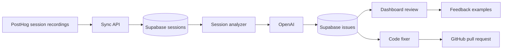

# ExterVision

ExterVision is an AI QA loop for production web apps. It pulls replay evidence from PostHog, turns that evidence into structured bug and UX findings with OpenAI, stores the findings in Supabase, and can optionally create scoped GitHub pull requests for high-confidence issues.

The current product analyzes session telemetry such as page views, clicks, rage clicks, dead clicks, console errors, network failures, and custom events. It does not yet send raw replay video or visual frames to the model.

## What It Does

- Connects PostHog, OpenAI, GitHub, and Supabase.
- Syncs recent PostHog session recordings into a local `sessions` table.
- Summarizes each session into evidence the AI can inspect.
- Uses OpenAI to classify actionable issues as bugs, UX friction, errors, or performance problems.
- Stores findings as reviewable issues with severity, root cause, reproduction steps, suggested fixes, and confidence.
- Uses user feedback on findings as future prompt examples.
- Optionally generates GitHub branches and pull requests for high-confidence, high-severity issues.

## Architecture



## Core Flow

1. A user signs in with Supabase Auth.
2. The user configures a project with PostHog, OpenAI, and optionally GitHub credentials.
3. Integration keys are encrypted with AES-256-GCM before storage.
4. `/api/posthog/sync` fetches new PostHog recordings and stores session evidence.
5. `/api/analyze` or `/api/analyze/[sessionId]` sends pending session summaries to OpenAI.
6. The analyzer asks for strict JSON findings and stores returned issues.
7. If GitHub is configured, high-confidence critical or high-severity issues can trigger automatic PR generation.
8. Confirmed or rejected findings are saved as prompt examples for future analysis.

## Tech Stack

- Next.js App Router
- React
- Tailwind CSS
- Supabase Auth and Postgres
- OpenAI SDK
- PostHog API
- GitHub API via Octokit
- Vercel deployment and cron

## Important Files

| Area | File |
| --- | --- |
| PostHog ingestion | `src/lib/posthog.ts` |
| Session analysis | `src/lib/analyzer.ts` |
| Background agent | `src/app/api/agent/route.ts` |
| Manual analyze endpoints | `src/app/api/analyze/route.ts`, `src/app/api/analyze/[sessionId]/route.ts` |
| GitHub fix generation | `src/lib/fixer.ts`, `src/lib/github.ts` |
| Feedback loop | `src/lib/self-improve.ts` |
| Encryption | `src/lib/encrypt.ts` |
| Database schema | `supabase-schema.sql` |
| Vercel cron config | `vercel.json` |

## Data Model

The main Supabase tables are:

- `projects`: user-owned project configuration and encrypted integration keys.
- `sessions`: synced PostHog replay evidence and analysis status.
- `issues`: AI-generated findings and optional PR metadata.
- `issue_feedback`: user verdicts on generated issues.
- `prompt_examples`: confirmed or rejected examples used in future prompts.
- `detection_config`: precision/sensitivity tracking by issue category.
- `signals`: custom user-defined signal descriptions.

Run `supabase-schema.sql` in the Supabase SQL editor to create the schema, RLS policies, and indexes.

## Environment Variables

Create `.env.local` for local development:

```bash
NEXT_PUBLIC_SUPABASE_URL=
NEXT_PUBLIC_SUPABASE_ANON_KEY=
SUPABASE_SERVICE_ROLE_KEY=
ENCRYPTION_KEY=
CRON_SECRET=
NEXT_PUBLIC_APP_URL=http://localhost:3000
```

`ENCRYPTION_KEY` must be a 32-byte key encoded as 64 hex characters:

```bash
openssl rand -hex 32
```

Integration credentials entered in the dashboard:

- PostHog personal API key
- PostHog project ID
- OpenAI API key
- GitHub personal access token
- GitHub repo in `owner/repo` format

## Local Development

Install dependencies:

```bash
bun install
```

Create the database schema:

1. Open the Supabase SQL editor.
2. Paste the contents of `supabase-schema.sql`.
3. Run the SQL.

Start the app:

```bash
bun dev
```

Open:

```text
http://localhost:3000
```

After signing in, go to `/dashboard/settings` and connect PostHog, OpenAI, and GitHub.

## Manual Operation

From the dashboard:

- **Sync replays** calls `/api/posthog/sync` and imports new PostHog sessions.
- **Analyze loops** calls `/api/analyze` and processes pending sessions.
- **Start watch** calls `/api/agent/start`, which triggers the background agent endpoint.

Individual pending sessions can also be analyzed from the sessions page.

## Background Agent

`/api/agent` performs the full loop:

1. Load projects with `sync_enabled = true`.
2. Sync new PostHog recordings.
3. Analyze pending sessions.
4. Store issues.
5. Create GitHub PRs for high-confidence severe issues when configured.

The endpoint requires:

```text
Authorization: Bearer <CRON_SECRET>
```

## Vercel Deployment

The repository is configured with a daily Vercel Cron Job:

```json
{
  "path": "/api/agent",
  "schedule": "0 0 * * *"
}
```

Vercel Hobby accounts only support daily cron jobs. For true five-minute monitoring, use Vercel Pro or an external scheduler that calls `/api/agent` with the `CRON_SECRET` bearer token.

Set these environment variables in Vercel:

- `NEXT_PUBLIC_SUPABASE_URL`
- `NEXT_PUBLIC_SUPABASE_ANON_KEY`
- `SUPABASE_SERVICE_ROLE_KEY`
- `ENCRYPTION_KEY`
- `CRON_SECRET`
- `NEXT_PUBLIC_APP_URL`

## AI Behavior

The session analyzer currently sends a text prompt containing:

- session duration and user ID
- total events
- click counts
- rage clicks and dead clicks
- pages visited
- key custom actions
- console errors
- failed network requests
- recent confirmed and rejected issue examples

The model returns JSON findings in this shape:

```json
{
  "findings": [
    {
      "type": "bug",
      "severity": "high",
      "title": "Short title",
      "description": "What happened and why it matters",
      "reproduction_steps": "How to reproduce",
      "affected_component": "Page or component",
      "root_cause": "Likely cause",
      "suggested_fix": "Recommended fix",
      "confidence": 0.85
    }
  ]
}
```

Invalid or unparsable model output is treated as no findings.

## Current Limitations

- Replay video is not analyzed directly.
- PostHog snapshots are available through a helper method but are not stored or passed to OpenAI yet.
- The AI relies on summarized telemetry, so it can miss visual layout bugs that do not produce errors or strong event signals.
- `detection_config` tracks precision and sensitivity, but analyzer behavior is still mainly controlled by prompt examples.
- The serverless background watch loop is best-effort. Reliable high-frequency monitoring should use a real scheduler or worker.
- Generated PRs should be reviewed before merge.

## Roadmap Ideas

- Store selected PostHog replay snapshots or sampled frames.
- Send replay frames as image inputs alongside event summaries.
- Add structured model output validation instead of regex-based JSON extraction.
- Use `detection_config` to tune prompt strictness by category.
- Add duplicate issue clustering across sessions.
- Add regression tests or replay-based verification for generated fixes.

## Scripts

```bash
bun dev      # start local development server
bun build    # create production build
bun start    # run production server
bun lint     # run ESLint
```

## Security Notes

- User-facing access is checked with Supabase Auth.
- Row-level security policies restrict user-owned project data.
- Backend service-role access is used only in server routes.
- Stored integration keys are encrypted before insertion.
- Never expose `SUPABASE_SERVICE_ROLE_KEY`, `ENCRYPTION_KEY`, or `CRON_SECRET` to the browser.

## License

ExterVision is licensed under the GNU Affero General Public License v3.0.

```text
SPDX-License-Identifier: AGPL-3.0-only
```

This follows the AGPL license used by BlazeUp-AI/Observal.
